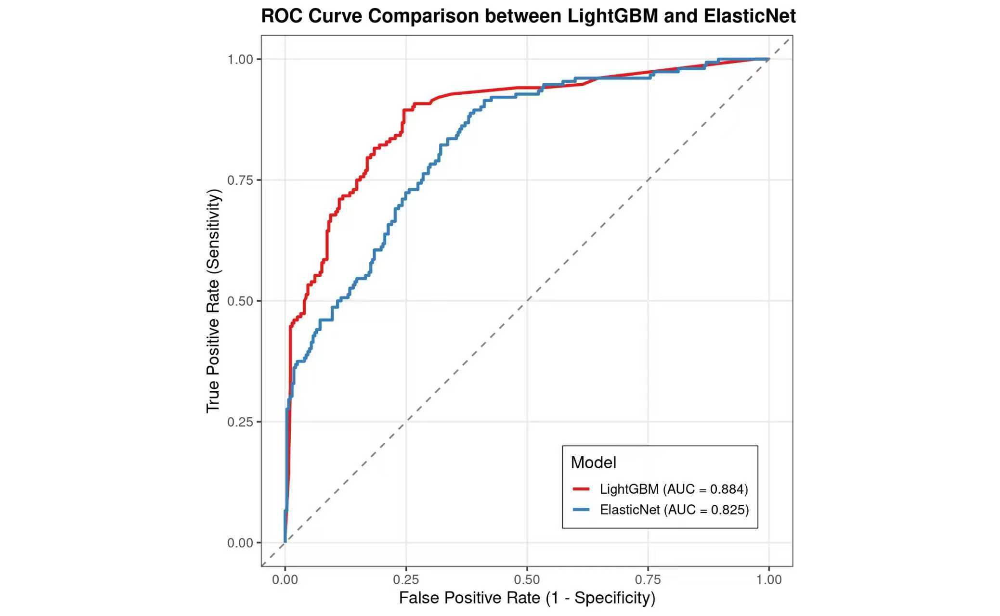

<!-- README.md is generated from README.Rmd. Please edit that file -->

```{r, include = FALSE}
knitr::opts_chunk$set(
  collapse = TRUE,
  comment = "#>",
  fig.path = "man/figures/README-",
  out.width = "100%"
)
```

# AlzPreFunction instruction

<!-- badges: start -->
<!-- badges: end -->

This R package was developed for predicting Alzheimer's disease risk. You can find our dataset at:https://www.kaggle.com/dsv/8668279

Based on a Kaggle bioinformatics dataset,we developed seven machine learning models and one deep learning model. The champion model is LightGBM (AUC = 0.937), which showed superior performance and robustness compared to the contrast model Elastic Net (AUC = 0.899).As a result,we choose to use random forest.

The package implements the trained LightGBM model with necessary data preprocessing and exports a prediction function that returns classified risk outcomes ("High Risk" or "Low Risk") as required.

## Installation

You can install the development version of AlzPreFunction like so:

``` r
if (!require("remotes")) install.packages("remotes")

remotes::install_github("你的GitHub用户名/AlzPreFunction")
```
To update between versions, please remove old version with the following codes and then reinstall it with the above codes.

``` r
remove.packages("AlzPreFunction")
detach("package:AlzPreFunction")
``` 
## Example

This is a basic example which shows you how to solve a common problem:

```{r example}
library(AlzPreFunction)

# Load the example dataset (processed input features)
data(example_input)

# View the data
head(example_input)

# Predict Alzheimer's risk
predictions <- predict_risk(example_input)

# View predictions
head(predictions)

# Summary of risk levels
table(predictions)
```

## Model Performance

The following table compares the performance of the champion model and the contrast model based on 5-fold cross-validation:

## Model Performance Comparison

The table below compares the champion and contrast models based on 5-fold cross-validation:

| Model                 | AUC     | Key Characteristics                                      |
|:----------------------|:-------:|:---------------------------------------------------------|
| **LightGBM** (Champion) | **0.937** | Highest AUC, fast training, excellent handling of categorical features |
| Elastic Net (Contrast) | 0.899   | Linear model with built-in feature selection, good interpretability |

The LightGBM model was selected as the final deployed model due to its superior predictive performance.

## Performance Visualization

```{r performance-plot, echo=FALSE, fig.cap="ROC Curves for Random Forest and Elastic Net Models"}
knitr::include_graphics("inst/extdata/PRC.jpg")


