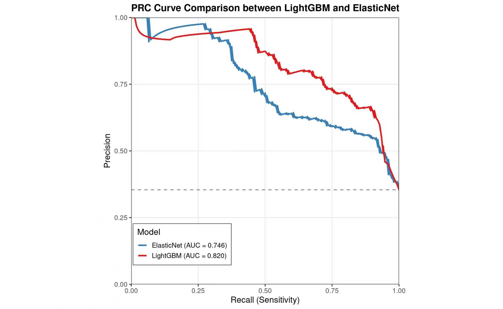

AlzPreFunction: Alzheimer’s Disease Risk Prediction
================

<!-- README.md is generated from README.Rmd. Please edit that file -->

          []()


## Overall

<!-- badges: start -->

<!-- badges: end -->

This R package was developed for predicting Alzheimer’s disease risk.
You can find our dataset at:<https://www.kaggle.com/dsv/8668279>

Based on a Kaggle bioinformatics dataset,we developed seven machine
learning models and one deep learning model. The champion model is
LightGBM (AUC = 0.937), which showed superior performance and robustness
compared to the contrast model Elastic Net (AUC = 0.899).As a result,we
choose to use LightGBM.

The package implements the trained LightGBM model with necessary data
preprocessing and exports a prediction function that returns classified
risk outcomes (“High Risk” or “Low Risk”) as required.

## Installation

You can install the development version of AlzPreFunction like so:

``` r
if (!require("remotes")) install.packages("remotes")

remotes::install_github("jifenglinglan/AlzPreFunction")
```

To update between versions, please remove old version with the following
codes and then reinstall it with the above codes.

``` r
remove.packages("AlzPreFunction")
detach("package:AlzPreFunction")
```
Dependencies:LightGBM,Elastic Net
R version requirement:R ≥ 3.5.0
## Example

This is a basic example which shows you how to solve a common problem:

``` r
library(AlzPreFunction)

# Load the example dataset (processed input features)
data(example_input)

# View the data
print(example_input)

# Predict Alzheimer's risk
predictions <- predict_risk(example_input)

# View predictions
head(predictions)

# Summary of risk levels
table(predictions)
```

## Model Performance

The following table compares the performance of the champion model and
the contrast model based on 5-fold cross-validation:

The table below compares the champion and contrast models based on
5-fold cross-validation:

| Model | AUC | Key Characteristics |
|:---|:--:|:---|
| **LightGBM** (Champion) | **0.884** | Highest AUC, fast training, excellent handling of categorical features |
| Elastic Net (Contrast) | 0.825 | Linear model with built-in feature selection, good interpretability |

The LightGBM model was selected as the final deployed model due to its
superior predictive performance.

## Performance Visualization

<table>
  <tr>
    <td align="center">
      <strong>Precision-Recall Curve (PRC)</strong><br>
      
      <br>
      This PRC graph further compares the performance of the two models in scenarios where the positive class samples are relatively scarce, with a focus on the trade-off between precision and recall.
    </td>
    <td align="center">
      <strong>ROC Curve</strong><br>
      
      <br>
      This ROC curve illustrates the comparison of classification performance between the LightGBM and ElasticNet models in the Alzheimer's disease prediction task.
    </td>
  </tr>
</table>

This PRC graph（First figure) further compares the performance of the two models in scenarios where the positive class samples are relatively scarce, with a focus on the trade-off between precision and recall.

This ROC curve illustrates the comparison of classification performance between the LightGBM and ElasticNet models in the Alzheimer's disease prediction task.
## Group Division

Hongyao.Yang 2363361 Machine learning modeling Keyu.Fang 2252078 and
Zhenyu.Yang 2363283 Shiny website for database and model deployment
Yuzou.Lu 2360162 Create an R package for reproducible software

Finally, we jointly completed the project report.
## Reference
